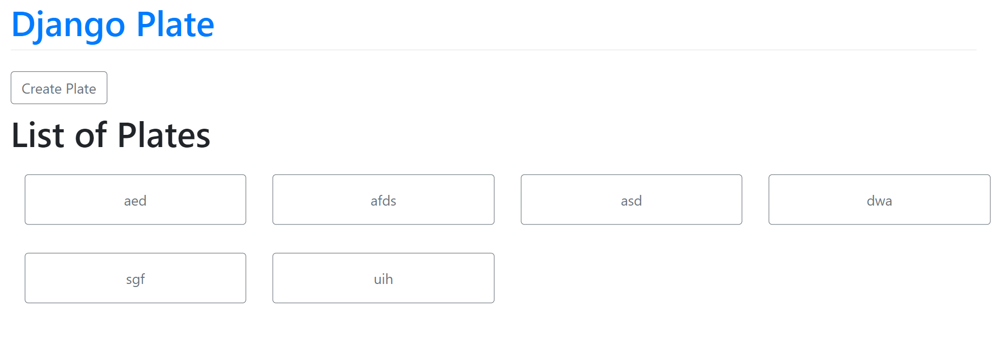
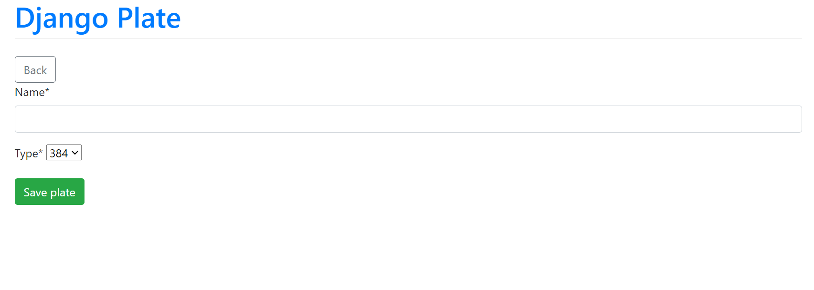
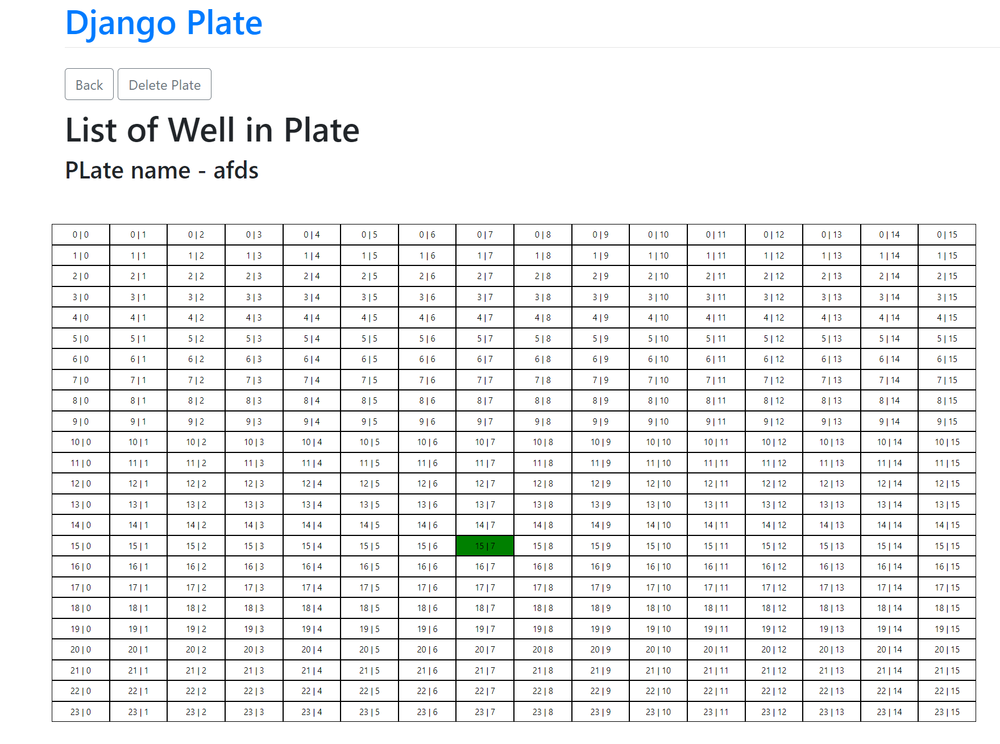

# assay-plate-designer
**assay-plate-designer** full-stack web application designed to assist scientists in planning and managing their experiments using assay plates. Key features include:
- Create new plates
- Add information to wells
- View well details
- Edit well information
- Delete plates

## Pre-requirements
- Operating System: Linux
- Language: Python3 (>=3.10)
- Framework: Django with class-based views

### Installation Steps
1. Ensure your Linux environment is properly set up.
2. Install Python3 (>=3.10), pip, and [Django](https://docs.djangoproject.com/en/4.2/topics/install/).
3. Install the necessary libraries:
```
pip install django-crispy-forms
pip install crispy-bootstrap5
```

## Running the web app (on Linux)
1. Navigate to the *Project* directory 
```
cd path/to/Project
```
2. Activate the virtual environment:
```
source ./venv/bin/activate
```
3. Run the Django server:
```
python3 manage.py runserver
```
4. Open your web browser and navigate to the displayed HTTP link. You should see the main Django Plate web page.

## Visualization Overview of the Web App
1. The main Django Plate page: The starting point and main dashboard.

2. Create Plate: Allows users to design and set up a new plate.

3. Edit Plate: Lets users modify the content and details of an existing plate.
